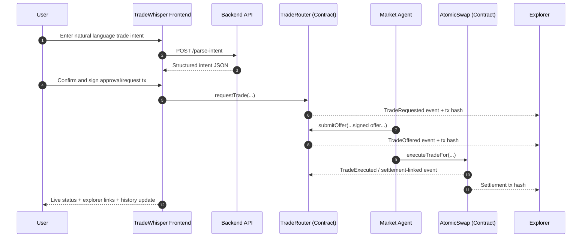

# TradeWhisper

Just whisper your trade. The chain handles the rest.

TradeWhisper is a conversational OTC protocol built for HashKey Chain. A user types a natural-language request like "sell 10 USDC for HSK", and the system turns that into a real on-chain request, autonomous market response, and atomic settlement.

## Project Summary
	
- Primary track fit: AI
- Secondary track fit: DeFi
- Core idea: remove DeFi UX friction while keeping full on-chain verifiability
- Demo principle: no mocks, all important actions are explorer-verifiable

## Problem

- OTC trading today is often off-chain and trust-heavy
- DEX UX is too complex for many users (AMMs, slippage, LPs)
- HashKey testnet lacked a chat-native, atomic OTC flow with public reputation

## Solution

- Chat-first trading interface
- AI intent parsing to strict trade schema
- On-chain request and offer lifecycle
- Atomic settlement in a single transaction (or no trade)
- On-chain market-maker reputation tracking

## Architecture

### 1) Frontend Layer (Next.js)

- User-facing routes in [TradeWhisperFrontend/app/page.tsx](TradeWhisperFrontend/app/page.tsx), [TradeWhisperFrontend/app/trade/page.tsx](TradeWhisperFrontend/app/trade/page.tsx), [TradeWhisperFrontend/app/history/page.tsx](TradeWhisperFrontend/app/history/page.tsx), [TradeWhisperFrontend/app/leaderboard/page.tsx](TradeWhisperFrontend/app/leaderboard/page.tsx), [TradeWhisperFrontend/app/docs/page.tsx](TradeWhisperFrontend/app/docs/page.tsx)
- Chat and wallet logic in [TradeWhisperFrontend/components/trade/TradeChat.tsx](TradeWhisperFrontend/components/trade/TradeChat.tsx)

### 2) Backend Agent/API Layer (Node.js + TypeScript)

# TradeWhisper

## Just whisper your trade. The chain handles the rest.

TradeWhisper makes OTC trading feel like sending a message.

Instead of navigating complex DeFi forms, users describe what they want in plain language, receive on-chain offers, and complete settlement atomically on HashKey Chain.

For judges, this creates the aha moment quickly:

- Natural-language input
- Real on-chain lifecycle
- Verifiable transaction trail
- Atomic execution with transparent reputation

---

## Why This Matters

DeFi is powerful, but execution UX still excludes many users.

- Traditional DEX flows require deep protocol knowledge
- OTC coordination often happens in fragmented off-chain channels
- Trust and auditability are hard to prove in real time

TradeWhisper solves this by combining conversational intent + on-chain execution into one coherent flow.

---

## What TradeWhisper Does

Users can write intents like:

"Sell 10 USDC for HSK, minimum 33 HSK"

The system then:

1. Parses intent into structured trade parameters
2. Publishes a request on-chain
3. Receives and evaluates market-maker offers
4. Executes accepted offers atomically
5. Shows explorer-verifiable transaction status in UI

---

## Architecture Overview

### Frontend

- Next.js interface for chat, wallet connect, lifecycle visibility
- Routes: Home, Trade, History, Leaderboard, Docs

### Backend + Agents

- Intent parsing API
- Market agent listening to request events and submitting signed offers
- Evaluation logic and execution trigger path

### On-Chain Protocol

- TradeRouter: request and offer coordination
- AtomicSwap: settlement execution
- ReputationRegistry: market-maker reputation updates

---

## Sequence Diagram



---

## Deployed Contract Addresses (HashKey Testnet)

| Contract | Address |
| --- | --- |
| TradeRouter | `0xEEb42D6F9E90Bc13BBb0077d9CAC972a48C59d24` |
| AtomicSwap | `0x71e7763BB53AEf04CbC5Ee784A146e7Eb08A019b` |
| ReputationRegistry | `0x7C5e03ea5185bF4A6E4DDc6fd6B7Fba75b760471` |
| USDC Token | `0xCA886ebef3d708fA61bD3b3606F31c904258ec3A` |
| HSK Token | `0x55f11eD5DF8a2d78cC69a8e39464841e86F278a3` |
| Price Oracle | `0x7642cf590101545ffE78B2Ec07504e2b7C9C2998` |

Explorer:

- https://testnet-explorer.hsk.xyz

---

## Live URLs

- Frontend: https://tradewhisper.vercel.app
- Backend: https://tradewhisper-backend.onrender.com
- Backend health: https://tradewhisper-backend.onrender.com/health

---

## Judge Quick Verification Runbook

1. Open https://tradewhisper.vercel.app/trade
2. Connect MetaMask on HashKey Testnet (Chain ID 133)
3. Click Get 100 Test USDC
4. Enter: "Sell 10 USDC for HSK. I want at least 33 HSK."
5. Approve wallet transaction when prompted
6. Observe request, offer, and execution lifecycle in chat
7. Open transaction links and verify events on HashKey explorer

---

## Key Product Features

- Conversational OTC interaction (plain language)
- Structured intent parsing and confirmation
- Contract-based request and offer lifecycle
- Atomic settlement
- Reputation-aware market-maker behavior
- Trade history and leaderboard visibility
- Explorer-native proof for every critical step

---

## Technology Stack

- Blockchain: HashKey Chain Testnet (EVM)
- Smart contracts: Solidity + Hardhat
- Backend: Node.js + TypeScript + Express + ethers
- Frontend: Next.js + React + Tailwind + ethers v6
- Wallet: MetaMask

---

## Try It Locally

### Prerequisites

- Node.js 18+
- MetaMask
- HashKey testnet configuration in wallet

### Setup

```bash
npm install
cd TradeWhisperFrontend
npm install
cd ..
```

### Environment

- Backend template: `.env.example`
- Frontend template: `TradeWhisperFrontend/.env.local.example`

### Start Backend

```bash
npm run dev
```

### Start Frontend

```bash
cd TradeWhisperFrontend
npm run dev
```

### Open

- http://localhost:3001/trade

---

## API Endpoints

- `GET /` service info
- `GET /health` live runtime status and address config
- `POST /parse-intent` intent parsing endpoint

---

## Submission Positioning (Hackathon)

TradeWhisper demonstrates a practical AI + DeFi infrastructure narrative:

- AI as the user interaction and decision layer
- DeFi contracts as the trust and settlement layer
- Real-time, explorer-verifiable lifecycle for transparent judging

This is not just a UI concept, but a full protocol flow from user intent to settled on-chain state.
